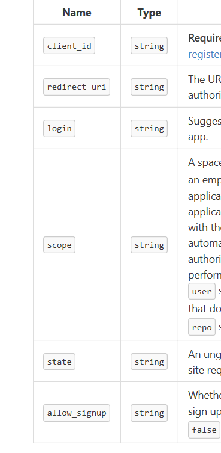

##阿杰社区
    登录：
    1.跳转到github处登录并得到github的client_id
    2.然后用github中的API接口，传入

##资料
[GitHub OAuth]https://developer.github.com/apps/building-oauth-apps/creating-an-oauth-app/
[]http://localhost:8080/index#
##工具
[Git]
